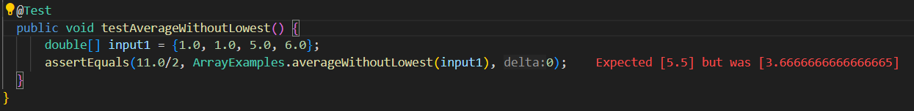

# Symptoms
Using JUnit tests lets look at the outputs of the code and use it to determine which part of the method is not working as intended.

---
	\
\
Here we can see that the actual output has the result of 11.0/3 instead of 11.0/2. Based on the output we can assume that something 
is wrong with the removal of the lowest number(s) as the sum is the correct expected amount.

---
 \
\
Here we see the code working as intended. Based on the above output we can assume that the code is at least taking out the lowest 
number for the sum and dividing, at least in this case, by the right number. 

---
Based on this information lets look at the part of the method relating to the division and see if anything is wrong.
