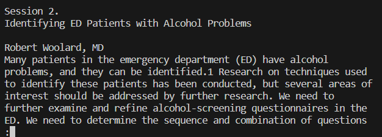

# Information and Utilization of less
The `less` command is used to view Java source code files, log files, or any other text-based files in the terminal and 
is best used when there are a lot of files to be viewed. The terminal will display one screen worth of info and can be traversed 
through with the arrow keys to "scroll" through the list to see other parts of the output.  
(info recieved by ChatGPT with the prompt "what does the less command do in java")
The following showcase of commands will be done on a directory called `technical/` which is a sample of writing in English 
from https://anc.org/data/oanc/download/, a free and open corpus of English text samples.  

---
Here is an example of the `less` command used without any command-line options. The command run is:\
`$ less technical/government/Alcohol_Problems/Session2-PDF.txt`  
\

---
The following are examples of command-line options and explanations of what they do.  
(Each option and explanation comes from asking ChatGPT "what are some command line options for the less command in java")

 [`less -N`](lab3_less_-N.md) See line numbers  
 [`less +<number>`](lab3_less_+.md) Start at specified line number  
 [`less /<patter>`](lab3_less_pattern.md) Look for specified pattern  
 [`less -i`](lab3_less_-i.md) Case-insensitive searching  
