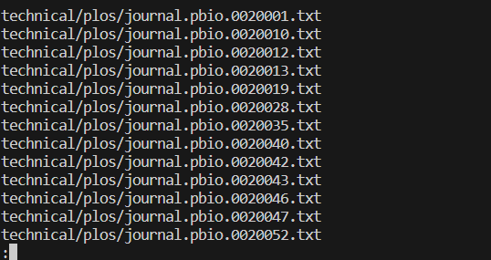

# Information and Utilization of less
The `less` command is used to view Java source code files, log files, or any other text-based files in the terminal and 
is best used when there are a lot of files to be viewed.  
The following showcase of commands will be done on a directory called `technical/` which is a sample of writing in English 
from https://anc.org/data/oanc/download/, a free and open corpus of English text samples.  

---
Here is an example of the `less` command used without any command-line options:  
  

