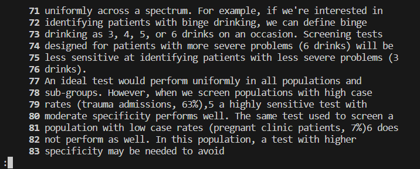

# `less +<number>`
the `+<number>` option makes it so that the output will start displaying the document at the line of the input number. This is best used alongside -N.
##  Example:  
  
Here we see that the output is the same as with no options except that you can see there are line numbers on the left.  
This image is taken just after the output is given.  

---
  
Here is the same output and terminal except after scrolling through the output with the down arrow.  

---
[back to less commands](lab3_less.md)
