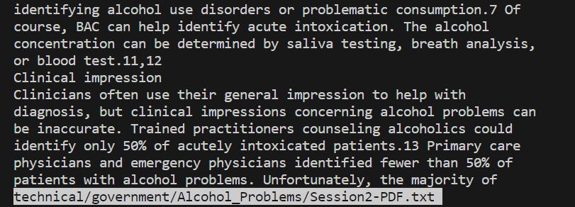

# `less +<number>`
the `+<number>` option makes it so that the output will start displaying the document at the line of the input number.  
This is best used alongside -N.
##  Example:  
  
The command run was `$ less +135 technical/government/Alcohol_Problems/Session2-PDF.txt`
Here the output puts the first line on the line number that we put in the command.

---
  
Here the command run was `$ less -N +135 technical/government/Alcohol_Problems/Session2-PDF.txt`
Here is the same output and terminal except you can see the line numbers on the side. Together these can be useful if you need to work on specific lines and want to better track your position in a file. 

---
[back to less commands](lab3_less.md)
