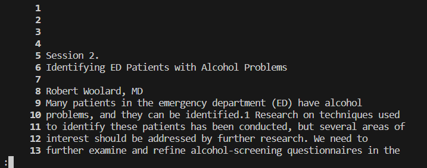

# less -N
the `-N` option for `less` adds line numbers to the output, making it easier to keep track when scrolling through 
the output in the terminal.  
##  Example:  
  
Here we see that the output is the same as with no options except that you can see there are line numbers on the left.  
This image is taken just after the output is given.  

---
  
Here is the same output and terminal except after scrolling through the output with the down arrow.  

---
[back to less commands](lab3_less.md)
