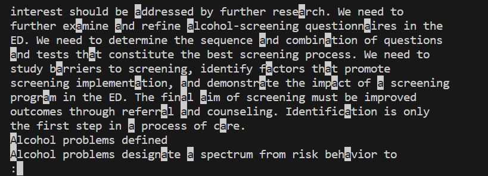
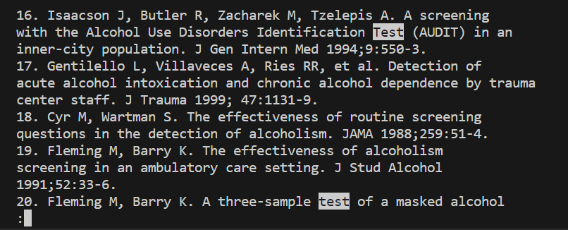

# `less -i`
The `less -i` command will make it so that when you use `/<patter>` any results that match the letters, regardless of case-sensitivity, 
will be highlighted.
##  Example:  
  
Here after running `$ less -i technical/government/Alcohol_Problems/Session2-PDF.txt` we type `/a` the result highlihgts any occurence of 
the letter "a", whether it is capitalized or not, in the file.

---
  
Here just after running the previous command we run `/test` which displays test both capitalized or not, this could be used to search for a 
word that may appear in different cases where it would have altering case-sensitivity for more accurate locating of words.

---
[back to less commands](lab3_less.md)
