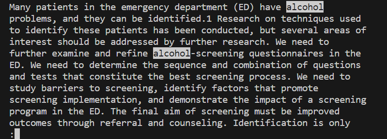
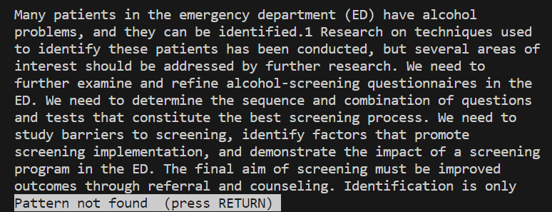

# `less /<pattern>
The `/<pattern>` command will highlight any occurence of the pattern you type. This is done after the `less` command is run and you are looking through the file.
##  Example:  
  
Here after running `$ less technical/government/Alcohol_Problems/Session2-PDF.txt` we type `/alcohol` the result highlihgts any occurence of "alcohol" in the file.

---
  
Here just after running `/alcohol` we run `danger` which does not appear in the file and therefore lets us know this. This can be used in order to see whether or not expected data is inside of a file of outputs or to see how repetitive some writing is. 

---
[back to less commands](lab3_less.md)
