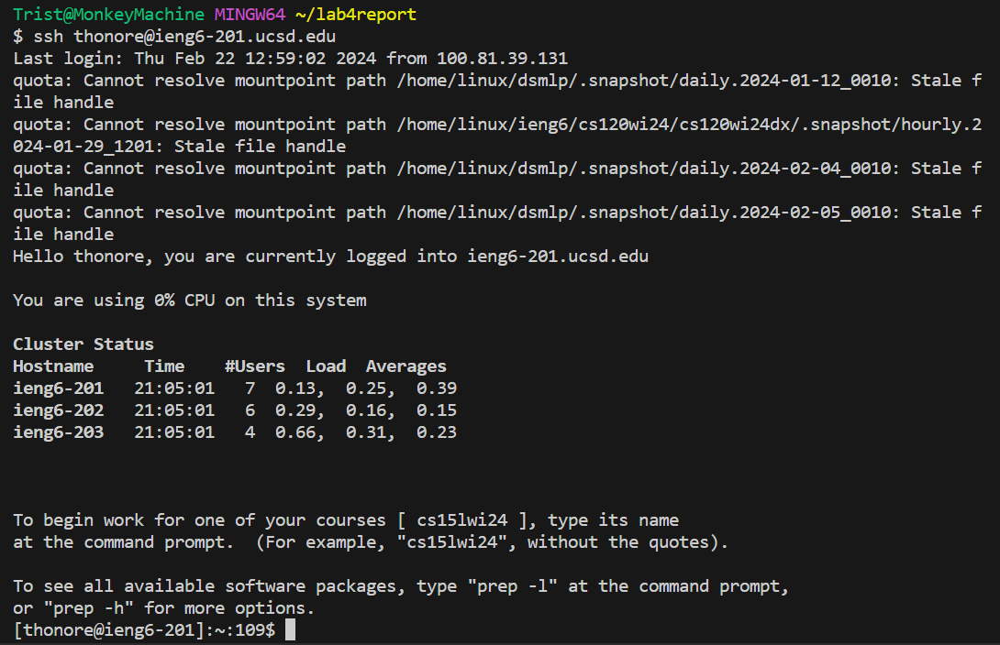

# Lab Report 4 - Vim
In this lab we learned to use Vim, a screen based text editor. In this report i'll be showing the 
utilization of Vimto change code inside of a file as well as key-specific instructions for the process.

---
Step 1: logging into `ieng6`
  

We begin with an empty workspace and run the command `$ ssh [USER]@ieng6-201.ucsd.edu` in the terminal.  
In this case im using my login which is thonore as seen in the screenshot.  
This logs us into the server where we will be doing the rest of this demonstration. 
  
[Next Page](lab4_2ndPg.md)  
  
  
[Back to Lab Reports](index.md)
