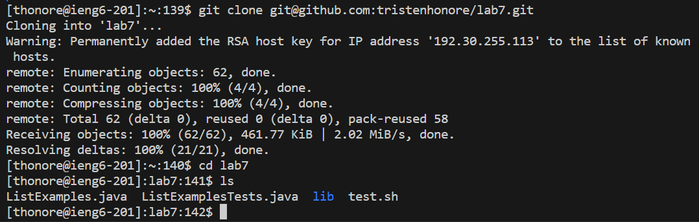

# Step 2: Cloning Repository from Github Account
Using the command `git clone git@github.com:tristenhonore/lab7.git` we get a forked repository from github and clone the files into the server.
\

\
Here we see that the file was cloned correctly and after cloning the `cd lab7` command was used to change directories into the lab7 directory and then `ls` was ran so that we can see the files within lab7. 
Within the files we have a tester script and a java file that we are going to be testing and tweaking using Vim.

[Next Page](lab_3rdPG.md)  
\
\
[Previous Page](lab4.md)

 
