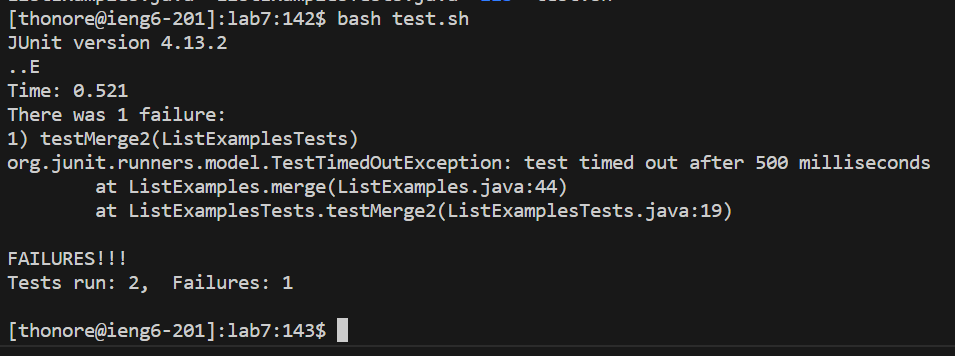

# Step 3: Testing the Code

We are now going to run the testing script using the command `bash test.sh` which will test the `ListExamples.java` file.  
\

We can see that the test successfully runs but the file itself fails 1 of the 2 tests. We are now going to use Vim to fix the code in this file so that both tests pass.  
  \
[Next Page](lab4_4thPG.md)  
\
\
[Previous Page](lab4_2ndPg.md)
