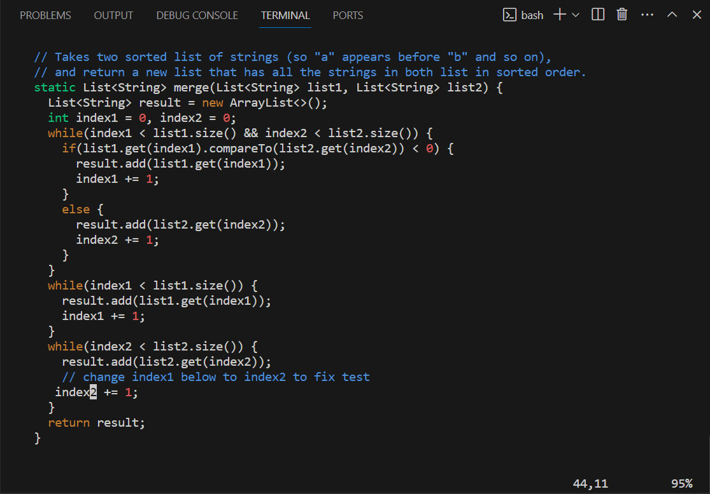

# Step 4 editing the code

We are now going to fix the code using Vim. We start by running the `vim ListExamples.java` command.
  
\
When we do vim we are inserted into the file and can edit the text. We fix this error by using the following series of keys beginning from the very first position in the code:  
`j` `j` `j` `j` `j` `j` `j` `j` `j` `j` `j` `j` `j` `j` `j` `j` `j` `j` `j` `j` `j` `j` `j` `j` `j` `j` `j` `j` `j` `j` `j` `j` `j` `j` `j` `j` `j` `j` `j` `j` `j` `j` `j` `l` `l` `l` `l` `l` `l` `d` `w` `a` `<left>` `<left>` `i` `n` `d` `e` `x` `2` `<escape>` `<Shift> + ;` `w` `q` `<Enter>`  
  
Using these keys goes down to the necessary line using `j`, then goes to the right using `l`, deletes the word "index1" using `d w`, begins appending using `a`, types "index2" in the correct position, exits append with `<escape>`, lets us type commands using `<shift> + ;` and lets us save and exit using `w q <Enter>`. this process changes the `index1` to `index2`.  
Now we'll test the file again.  
\
[Next Page](lab4_5thPG.md)  
\
\
[Previous Page](lab4_3rdPG.md)
