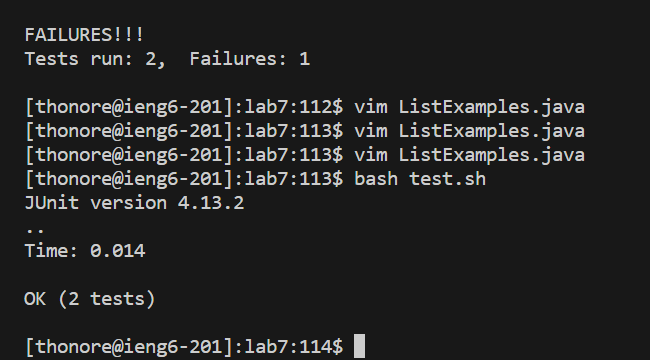

# Step 5 retesting

We will now repeat the testing using `bash test.sh`   
  
\
the tests now pass and we can move on to saving these to github.  
\
[Next Page](lab4_6thPG.md)  
\
\
[Previous Page](lab4_4thPG.md)
