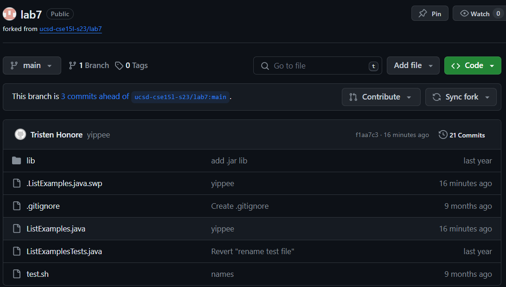

# Step 6 Committ and Push Change
Finally, we are going to run these three commands in order: `git add .` , `git commmit -m yippee` , `git push origin main` .  
`git add .` will set us up for commiting changes in the directory.  
`git commit -m yippe` will commit the changes and "yippee" will be the commit message that you will be able to see in github.  
`git push origin main` will push the committed change into the actual github site.
\
  

Here is the change visible in github after running the three commands.  
We have now demonstrated how Vim can be used in order to change code and other files while remotely accessing a server. 
  
  
[Previous Page](lab4_6thPG.md)  
\
\
[Back to All labs](index.md)
