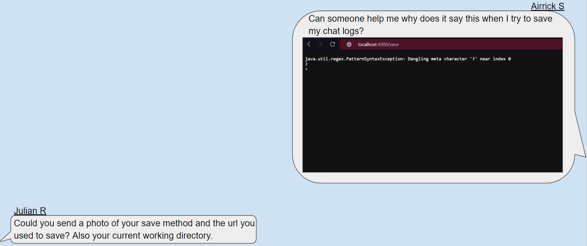

# Julian the TA saves Airrick's code
Airrick is having issues with his chat server. He sends a ticket to the support staff and Julian takes the ticket to help Airrick. 
  
Julian, having no information on anything related to the bug, asks for their code, working directory, and input to get some idea 
of whats going wrong. After this, Airrick sends the requested info...  
  
## [Next Page](lab_dbg2.md)  

## [Previous Page](lab.md)
