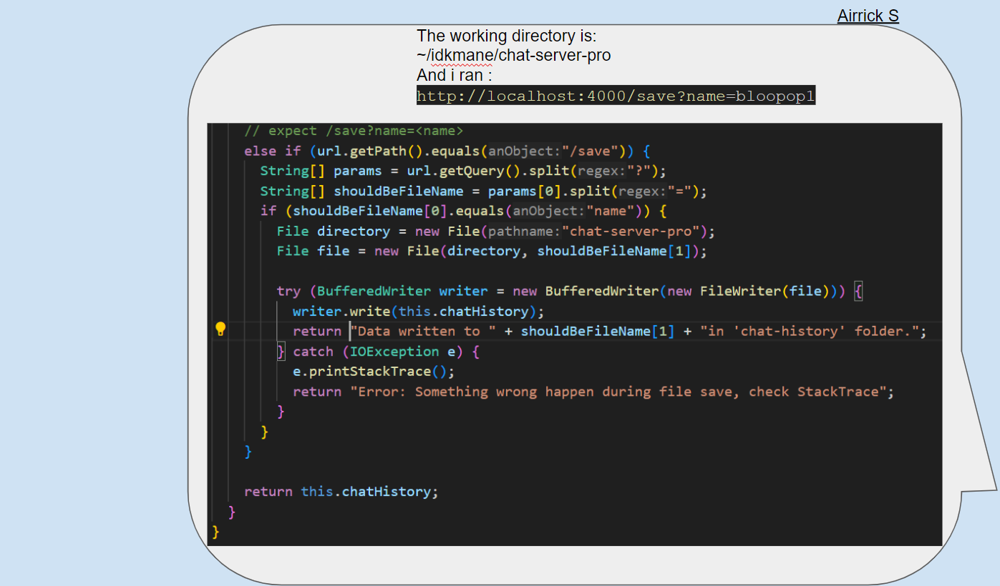

# Catching the Problem
Airrick sends the folloiing information for Julian to look at.  
  
Using this Julain sees the issue, He informs Airrick and he tells him what to do and to test.  
  
[Next Page](lab5_dbg3.md)  

[Previous Page](lab5_dbg.md)
