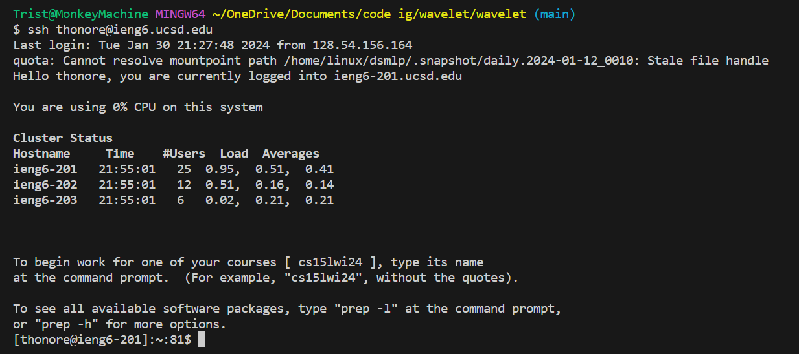

# ssh keygen
using the command `ssh-keygen` when signed into the ieng6 server we can create a key that will allow us to sign into the server without having to input our password. you can see below where the key is stored.\

\
in this image you can see that both the public and private key are both stored in the file path `/home/linux/ieng6/oce/28/thonore/.ssh`\
\
---
\
\

in this image you can see me sign into the ieng6 server without typing a password on my own computer.
\
[Back to Lab Report 2](labReport2.md)
